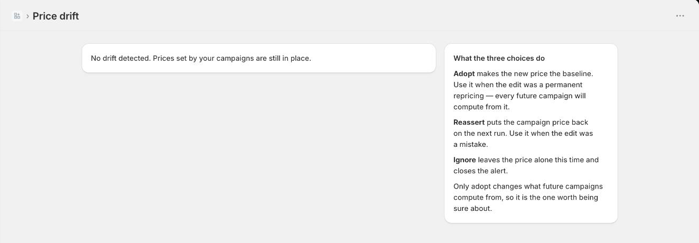

# What drift means

**Drift** is when a price on your storefront is not what this app last wrote.

It is not an error, and it is usually not a problem. It means somebody or something else
changed the price: you edited it in Shopify admin, another app touched it, or a bulk import
ran.

## Why we track it

Because the alternative is worse. If we ignored manual edits, the next revert would
overwrite them without asking — and a merchant who deliberately repriced one product would
find the app had quietly undone it. If we overwrote silently in the other direction, the
app's own ledger would be lying about what is live.

So drift is surfaced and you decide.

## What to do about it

Every drifted price waits for you on **Prices → Drift**, with both numbers side by side:
what the campaign set, and what the storefront shows now. Anything drifted is flagged on
the **What is live** page too.

There are three answers, and the first is the only one that changes anything permanently:

- **Keep the change** — the new price becomes the baseline. Use it when the edit was a
  permanent repricing: every future campaign computes its discount from this number
  instead of the old one. This is the one worth being sure about, and it is the only one
  the page marks as consequential.
- **Put it back** — the campaign rewrites its own price on the next run. Use it when the
  edit was a mistake.
- **Leave it for now** — nothing changes and the alert closes. The baseline is untouched,
  so the next campaign still computes from the old price and the edit stands until
  something else changes it.

Nothing is decided for you and nothing expires: a price stays on this page until you
answer.

When you revert a campaign, drifted products are listed separately with a tick box, so
ending a sale never silently discards a price you set on purpose.

## Drift versus off baseline

Different things, easily confused:

- **Off baseline** means the price differs from its normal price. That is what a sale *is*. Expected.
- **Drifted** means the price differs from what *we* wrote. That is somebody else's change.

A product on sale is off baseline and not drifted. A product on sale that somebody then
edited by hand is both.
