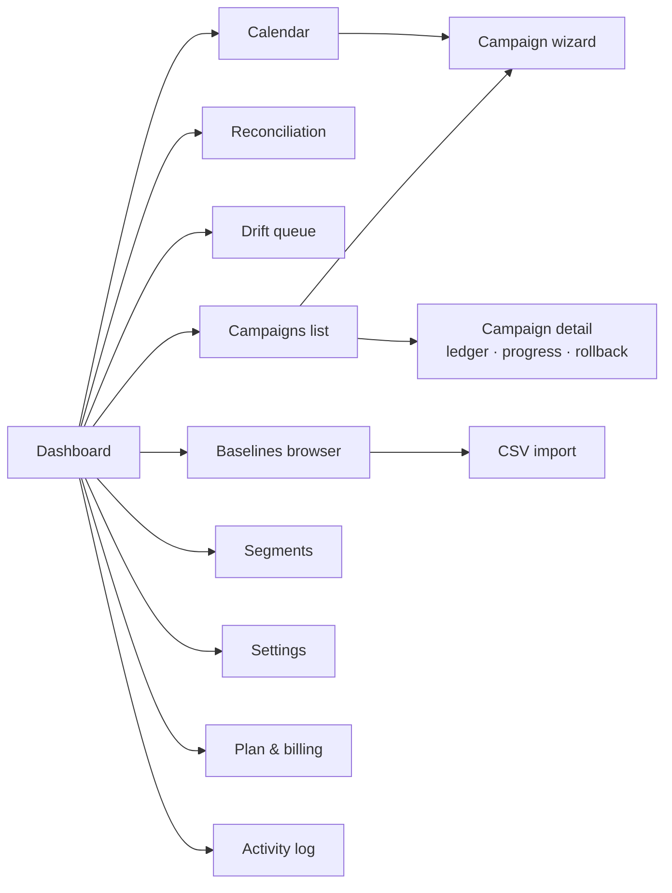

# Product requirements

Requirement IDs (`A-x.y`) are referenced from [`roadmap.md`](roadmap.md) tasks.

---

## 1. Problem

Merchants who run frequent promotions across markets and wholesale channels have no tool
that treats a price change as a managed, reversible, multi-surface operation. Existing apps
apply relative edits to live prices (so campaigns compound and reverts drift), ignore or
paywall Markets/B2B surfaces, and fail silently at scale. The cost of failure is revenue: a
half-applied sale or an un-reverted discount loses money until a human notices.

**Goals** — G1 campaigns are idempotent and exactly revertible · G2 one campaign prices
base + Markets + B2B · G3 no silent partial state, ever · G4 first campaign completed
within 10 minutes of install · G5 ≥4.8★ sustained and the Built-for-Shopify badge within
two review cycles.

**Non-goals** — competitor price crawling · general product content editing · storefront
theme widgets · multi-store sync · POS-specific pricing UI.

**Success metrics** — activation ≥60% (first campaign <24h) · verified-clean campaign rate
≥99.5% · free→paid ≥8% · Markets tier ≥40% of MRR by month 6 · median support response <4h
during promo windows.

---

## 2. Personas

| Persona | Context | Job to be done | Fears |
|---|---|---|---|
| **Priya** — promotions manager, multi-market DTC *(primary)* | 8K products, 5 markets, Shopify Advanced. 3–6 overlapping promos/month. | "When a promo window opens, put the right prices live on every market at once; when it closes, be certain everything is back." | Compounding discounts, un-reverted markets, an angry finance team. |
| **Marco** — wholesale ops, hybrid B2B/DTC | 2K SKUs, 40 B2B accounts, Shopify Plus. Retail + 3 wholesale catalogs with quantity breaks. | "When costs change, re-derive every catalog from cost + margin rules without breaking a negotiated floor." | Selling below cost; a stale catalog nobody re-checked. |
| **Dana** — agency operator *(secondary)* | Runs pricing for 6 client stores. | "Prove to my client exactly what changed, when, and that it reverted." | Being blamed for an app's silent failure. |

---

## 3. Feature inventory

Priority: **core** = required for public launch · **launch+** = fast-follow · **later** =
validate first.

### Epic 1 — Catalog & baselines

| ID | Capability | Priority | Requirements |
|---|---|---|---|
| A-1.1 | Catalog index | core | Local mirror of all products/variants incl. price, compare-at, cost, SKU, barcode, inventory, tags, vendor, type, status, collections, market price-list entries. Bulk-query import, webhook-maintained, nightly sampled audit. Handles 2,048-variant products and 500K-variant stores. |
| A-1.2 | Baseline ledger | core | Per variant × surface × currency: base price, base compare-at, cost, captured-at, source (install / recapture / CSV / drift-adoption). Baseline browser with filters and per-variant history. Recapture (scoped, confirmed, audited), CSV import by SKU/handle/gid with row-level error report, export. |
| A-1.3 | Baseline health | launch+ | Staleness signals: % of variants where live ≠ `resolve()`, age of oldest baseline, pending drift adoptions. Monthly dashboard nudge. |
| A-1.4 | Cost editing | launch+ | Bulk cost-per-item updates by rule or CSV; recalculates floors; flags active campaigns newly violating guardrails. |

### Epic 2 — Targeting

| ID | Capability | Priority | Requirements |
|---|---|---|---|
| A-2.1 | Filter builder | core | Conditions: collection, tag (AND/OR groups), vendor, type, status, title/SKU/barcode contains, price range, compare-at presence, cost presence, inventory qty ≶, created/updated date. Composes as (group OR group) where group = AND of conditions. Live debounced match count + 10-row sample. |
| A-2.2 | Saved segments | core | Named, reusable. Dynamic (re-evaluated at run/enroll time) or frozen (variant list pinned). Shows referencing campaigns; deletion blocked while referenced. |
| A-2.3 | Manual selection | core | Product/variant picker with search; mixes with filters; per-campaign exclusion list. |
| A-2.4 | CSV as filter | core | Upload SKUs/handles/gids; unmatched rows reported; result becomes a frozen segment. |

### Epic 3 — Campaigns

| ID | Capability | Priority | Requirements |
|---|---|---|---|
| A-3.1 | Adjustment rules | core | From baseline: ±%, ±fixed, set exact. From cost: × multiplier, + margin %. From compare-at: −%. Optional per-segment rule rows. All arithmetic in integer minor units with currency-aware precision. |
| A-3.2 | Rounding | core | Per-currency profiles: charm endings (.99/.95/.90/.00), step rounding (nearest 1/5/10), direction, zero-decimal currencies (JPY, KRW). Store default + per-campaign override. |
| A-3.3 | Compare-at policy | core | Per campaign: set to baseline price (strike-through), set/adjust by rule, clear, or leave. Validation blocks compare-at ≤ price; policy on violation: skip / clear / block. |
| A-3.4 | Surfaces | core | Base always; Markets (per-price-list, incl. per-market compare-at and per-currency rounding) on Markets tier; B2B (catalog price lists + quantity breaks) on Wholesale tier *(launch+)*. Any subset; preview and ledger are per-surface. |
| A-3.5 | Scheduling | core | Run now / at datetime / window / recurring (weekly, monthly, interval; skip-next; per-occurrence preview). Store-timezone aware incl. DST. Revert buffer. End = resolver recompute, not blind restore. |
| A-3.6 | Conflict resolution | core | Priority integer (default 100); winner per variant×surface = highest priority, tie → latest start, tie → id. Overlap surfaced at scheduling time with resolved-winner preview. Explicit stacking opt-in is *later*. |
| A-3.7 | Guardrails | core | Store-level: never below cost, min margin %, min price. Campaign overrides (tighter only). Violation policy: block / clamp / skip, always with a named report. Overrides need typed confirmation and are audit-logged. |
| A-3.8 | Preview & dry run | core | Before/after per variant per surface: price, compare-at, margin %, guardrail flags, conflict winner. Filterable, sortable, CSV-exportable. **Computed by the same resolver code path that executes.** |
| A-3.9 | Auto-enroll | core | New/edited products matching a dynamic segment of an active campaign: baseline captured → price applied within 5 min. Events ledgered. Per-campaign opt-out. |
| A-3.10 | Presentation kit | core | Campaign-scoped product tags (add on start, remove on end/revert, incl. auto-enrolled). No theme code. |
| A-3.11 | Blast-radius confirm | core | Campaigns over N variants (default 1,000) or >X% change (default 50%) require typed confirmation of the count. Configurable. |

### Epic 4 — Execution & trust

| ID | Capability | Priority | Requirements |
|---|---|---|---|
| A-4.1 | Change ledger | core | Per variant×surface×run: before / intended / applied / verified + status machine. Unlimited retention, all tiers. **Written before any API write.** |
| A-4.2 | Resumable jobs | core | Chunked with checkpoints; worker death or deploy mid-run resumes without duplicate or skipped writes; backoff retries; poison rows quarantined with a reason, never blocking the run. |
| A-4.3 | Verification | core | Bulk path: parse result JSONL per row. Sync path: read-back ≥10% sample plus every failed/ambiguous row. "Verified clean" requires 100%; anything else is a visible partial with per-row reasons and one-click resume. |
| A-4.4 | Rollback | core | Campaign-level and variant-level. Rollback = resolver recompute without the campaign; verified like any run; report of anything that drifted since apply, resolvable per row. |
| A-4.5 | Drift detection | core | Admin/API price edits during active campaigns detected ≤60s via webhook diff (self-echo suppressed). Policies: hold for review (default), adopt as baseline, reassert. Review queue with three-way action. |
| A-4.6 | Reconciliation view | core | Store-wide: live price, baseline, controlling campaign, drift flag, per variant×surface. Filters for "not at baseline", "controlled by X", "drifted". On-demand sampled fresh-read spot check. |
| A-4.7 | Progress & notifications | core | Live run progress (chunks done/total, ETA from observed throughput); email on completion, failure, drift-hold, revert; optional weekly digest; per-user preferences. |
| A-4.8 | Activity & audit log | core | Every state-changing action (who, what, when, before/after), queryable and CSV-exportable. Staff attribution via session identity. |

### Epic 5 — Operations surface, I/O, platform

| ID | Capability | Priority | Requirements |
|---|---|---|---|
| A-5.1 | Dashboard | core | Active/upcoming campaigns, last run status, drift queue count, baseline health, "what is live" summary. Empty states teach the model. |
| A-5.2 | Campaign calendar | core | Month/week views; overlap badges; click-through to resolved-winner preview; create-from-slot. |
| A-5.3 | CSV import/export | core | Exports: preview, ledger, reconciliation, baselines, audit. Imports: exact prices, baselines, costs by SKU/handle/gid, ≤500K rows, streamed validation with row-level error file. Matrixify-compatible headers. |
| A-5.4 | Onboarding | core | Install → baseline capture progress (explained) → guided first campaign on ≤5 products → practice mode (preview-only). Checklist until first verified-clean campaign. |
| A-5.5 | Settings | core | Guardrails, rounding profiles, drift policy, blast-radius thresholds, notifications, timezone display, data export, danger zone. |
| A-5.6 | Billing & plans | core | Managed pricing; tier gates (variant caps, surfaces); in-context upgrade prompts; downgrade → gated surfaces read-only, reverts always allowed, no data deletion. |
| A-5.7 | Margin & campaign P&L | launch+ | Preview margin deltas; post-campaign units/revenue vs trailing window (directional, clearly labelled). Needs `read_orders` + protected-data approval. |
| A-5.8 | Shopify Flow | launch+ | Triggers: campaign started/ended/held. Actions: start/end campaign, capture baseline. |
| A-5.9 | Approvals | later | Two-person rule above thresholds; approver named in audit log. |
| A-5.10 | Discount-mode campaigns | later | Execute as a Shopify Function automatic discount instead of a price rewrite; includes the sale-item code-stacking blocker. Gate: ≥30% of paying merchants request it. |

---

## 4. UX architecture

**Campaign wizard — five steps, each independently valid and saveable as a draft:**

1. **Scope** — saved segment or filter builder; live count + 10-row sample; manual
   includes/excludes. Cannot proceed with 0 matches.
2. **Rule** — adjustment + rounding profile + compare-at policy; inline example computed on
   3 sample variants, updating as you type.
3. **Surfaces** — base toggle; market price-list checklist (currency and adjustment mode
   shown per list); B2B catalogs. Gated surfaces render with an upgrade prompt, never hidden.
4. **Schedule** — now / window / recurring; timezone explicit; revert buffer; conflict panel
   showing overlapping campaigns and the resolved winner per overlap.
5. **Review** — full preview per surface; guardrail report; blast-radius confirmation if over
   threshold; save as draft / schedule / run.

Platform: Polaris web components; every table keyboard-navigable; WCAG AA; embedded via App
Bridge with session tokens; no full-page reloads inside admin.

---

## 5. Edge cases

These define correctness. Each maps to a test.

| # | Case | Required behavior |
|---|---|---|
| E1 | Two campaigns overlap; either ends first | All six orderings of (startA, startB, endA, endB) end at the correct resolver output. Property-tested. |
| E2 | Re-run after partial failure | Only unverified rows written; final state identical to a clean single run. |
| E3 | Merchant edits a price mid-campaign | Drift event ≤60s; no silent clobber; policy applies; revert honors the resolution choice. |
| E4 | Product/variant deleted mid-campaign | Rows marked skipped-deleted; revert skips gracefully; ledger notes it; no orphan retries. |
| E5 | Product leaves a dynamic segment mid-campaign | Stays priced until campaign end (membership fixed at enroll), flagged "left segment". |
| E6 | Product enters a dynamic segment mid-campaign | Auto-enroll: baseline captured first, then priced. Both ledgered. |
| E7 | Uninstalled during active campaigns | Data retained per policy; on reinstall, reconciliation shows what is still at campaign prices and offers bulk revert. We cannot write after uninstall — documented plainly. |
| E8 | Plan downgrade with active Markets campaigns | Campaigns complete their lifecycle incl. scheduled revert; no new gated campaigns; nothing orphaned at sale prices. |
| E9 | Zero-decimal currency (JPY) with a .99 charm profile | Charm inapplicable → step rounding; fractional JPY prevented by validation. |
| E10 | Rule computes a negative or zero price | Guardrail floor blocks or clamps per policy; never written. |
| E11 | Compare-at policy yields compare-at ≤ price | Flagged in preview; skip/clear/block per policy; never written invalid. |
| E12 | 2,048-variant product; 500K-variant store | Chunking makes no per-product assumptions; JSONL streamed both directions. |
| E13 | Bulk op fails/cancelled, or finish webhook never arrives | Poll fallback promotes; partial result parsed; unconfirmed rows re-verified by read; run resumes. |
| E14 | DST transition crosses a campaign boundary | Times stored UTC, rendered store-local; ambiguous local times → first occurrence; documented in-UI. |
| E15 | Market added or price list deleted mid-campaign | Surface sync flags it; affected rows marked; merchant prompted to extend or ignore. |
| E16 | Same variant matched by two rule rows in one campaign | Deterministic: last rule row wins; duplicates shown in preview. |
| E17 | Shop throttled by other apps' API traffic | Budget manager backs off on observed `throttleStatus`; run slows, never errors; ETA updates. |
| E18 | Reinstall with stale baselines | Fresh sync diffs against retained baselines; merchant chooses recapture-all or keep; nothing auto-applied. |

---

## 6. Non-functional requirements

| Area | Requirement |
|---|---|
| Scale | 500K variants/store · 150K variants/campaign · 2,048 variants/product · 50 concurrent active campaigns/store · 5K installed stores per deployment |
| Performance | 10K-variant preview <5s · filter count p95 <1.5s · dashboard p95 <1s · apply ≥5K variants/min via bulk path (queue permitting), honest ETA when not |
| Reliability | Verified-clean rate ≥99.5% · zero missed scheduler ticks (redundant tick + catch-up) · webhook lag p95 <30s · RPO ≤5 min, RTO ≤1h |
| Security | Least-privilege scopes · session-token auth · webhook HMAC · tokens encrypted at rest · no PII beyond shop/staff contact |
| Compliance | Mandatory GDPR topics answered correctly despite holding no customer data; shop redact purges within 30 days |
| Quality gates | Resolver + rounding property tests in CI · chaos suite green before any engine release · zero-downtime migrations only |
| i18n / a11y | English at launch with strings externalized · currency/number formatting per store locale · WCAG AA · Built-for-Shopify design criteria |

**Telemetry events** — `install`, `baseline_captured`, `segment_created`,
`campaign_created|previewed|scheduled|started`, `chunk_applied`,
`run_verified_clean|partial`, `drift_detected|resolved`, `rollback_executed`, `csv_import`,
`gate_viewed|upgraded`, `onboarding_step`. Each carries shop id, plan, variant counts and
durations — **never price values.**
