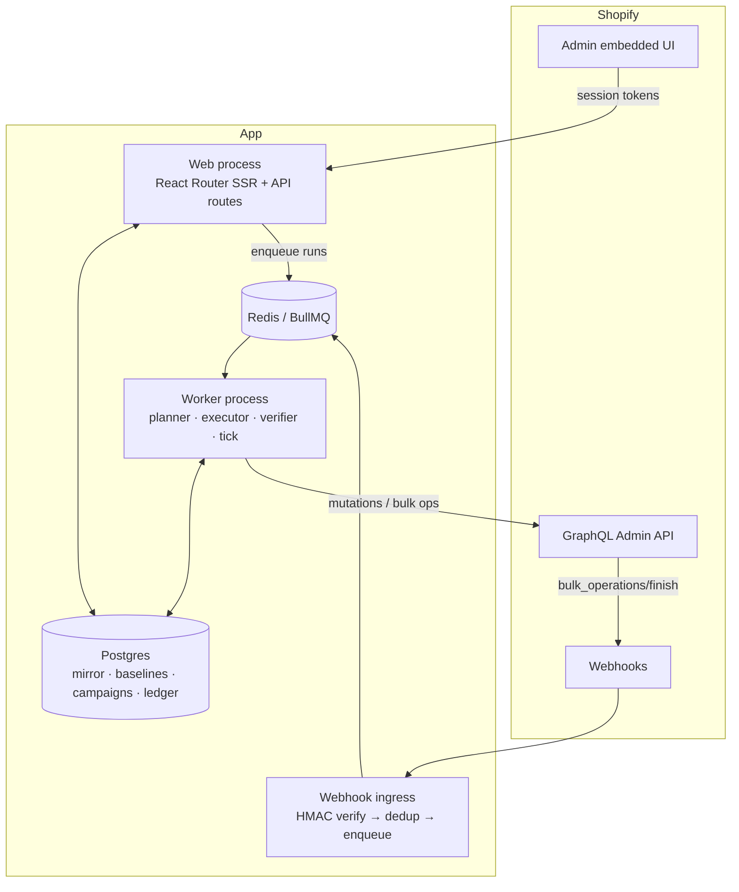

# RFC-001 — Architecture

**Status:** accepted · **Date:** August 2026 · **Supersedes:** nothing

The decisions here are commitments. Anything still open is in [`decisions.md`](decisions.md).

---

## 1. Stack

| Layer | Choice | Why |
|---|---|---|
| Framework | `shopify-app-template-react-router` (React Router 7) + `@shopify/shopify-app-react-router` | Shopify's current recommended path. The Remix template is legacy. |
| Admin UI | Polaris **web components** + App Bridge | The RR template is all-in on web components; they track admin design automatically, which hedges the Built-for-Shopify design criteria. |
| API | GraphQL Admin API only, version-pinned, typed via codegen | REST is legacy for products; every mutation we need is GraphQL-only regardless. |
| Database | Postgres 16 + Prisma | Relational fits the ledger/resolver joins. 500K-variant stores mean tens of millions of rows — the ledger is partitioned by shop. |
| Queue | Redis + BullMQ, dedicated worker process | Delayed jobs, priorities, rate limiting, repeatable jobs are all built in. Fallback if Redis ops burden bites: pg-boss. |
| Email | Resend | Campaign completion / failure / drift notifications. |
| Observability | Sentry + OpenTelemetry + a hosted dashboard | The SLOs in §11 need real dashboards from beta onward. |

Rejected: Rails (drops us off Shopify's first-party tooling and types); serverless
(long-lived workers streaming JSONL fit VMs better).

---

## 2. Topology



- **Web process** — admin UI, auth, preview computation (read-only resolver), settings,
  billing. **Never writes prices.**
- **Worker process** — the only price writer. Scheduler tick (30s, leader-elected), run
  planner, chunk executor, verifier, webhook consumers, nightly audits.
- **Ingress** — raw-body HMAC verify → insert `webhook_events` (unique on webhook id =
  dedup) → enqueue → return 200 immediately. Processing is always async.

---

## 3. Data model

| Table | Key columns | Notes |
|---|---|---|
| `shops` | id, domain, access_token_enc, scopes, plan_tier, timezone, settings JSONB, installed_at, uninstalled_at | Token encrypted at rest. Soft-delete on uninstall (E7/E18). |
| `variant_index` | shop_id, variant_gid, product_gid, sku, barcode, title, price, compare_at, cost, inventory_qty, status, vendor, product_type, tags[], collections[], synced_at | PK (shop_id, variant_gid). GIN on tags/collections. Money in integer minor units + currency. |
| `price_surface_entries` | shop_id, variant_gid, surface_type (base\|market\|b2b), price_list_gid?, currency, live_price, live_compare_at, synced_at | Mirrors market/B2B price-list entries. Base rows too, so reads are uniform. |
| `baselines` | shop_id, variant_gid, surface_type, price_list_gid?, currency, base_price, base_compare_at, cost, source, captured_at, superseded_at | Append-only versions. Current = `superseded_at IS NULL` (unique partial index). |
| `segments` | shop_id, name, kind (dynamic\|frozen), filter_ast JSONB, frozen_variant_ids?, created_by | AST = OR of (AND of conditions). Versioned on edit. |
| `campaigns` | shop_id, name, status, priority, rule_rows JSONB, rounding_profile_id, compare_at_policy, surfaces JSONB, schedule JSONB, segment_ids, excludes, tag_kit, flags | Index (shop_id, status). |
| `campaign_runs` | campaign_id, kind (apply\|revert\|reassert\|enroll), occurrence_key, status, planned/verified/failed_rows, started_at, finished_at | `occurrence_key` makes recurring runs idempotent. |
| `variant_changes` | run_id, shop_id, variant_gid, surface_type, price_list_gid?, before_*, intended_*, applied_at, verified_at, status, failure_reason, attempt | **The ledger.** Unique (run_id, variant_gid, surface_type, price_list_gid). Partitioned by shop_id. |
| `write_intents` | shop_id, variant_gid, surface, value_hash, written_at | Self-echo suppression window (§7). TTL-pruned. |
| `drift_events` | shop_id, variant_gid, surface, campaign_id?, observed_price, expected_price, detected_at, resolution, resolved_by | Feeds the drift queue UI. |
| `rounding_profiles` | shop_id, name, currency, mode (charm\|step), ending, step, direction | Seeded per enabled currency. |
| `webhook_events` | webhook_id (unique), shop_id, topic, payload JSONB, received_at, processed_at, status | Dedup + replay + lag metrics. |
| `bulk_ops` | shop_id, run_id, shopify_gid, kind, status, staged_upload_url, result_url, submitted_at, finished_at | Poll-fallback cursor when the finish webhook is missed (E13). |
| `audit_log` | shop_id, actor, action, entity, before JSONB, after JSONB, at | Append-only, exportable. |
| `billing_state` | shop_id, tier, managed_pricing_ids, trial_ends_at, variant_cap, gates JSONB | Synced from managed-pricing webhooks. |

Ledger row states: `pending → writing → applied → verified`, plus `failed`, `skipped_*`,
`clamped`, `reverted`.

---

## 4. The resolver

One pure function the whole product orbits. Preview renders its output; the planner diffs
it against live values; revert is `resolve(without C)`; reconciliation is `live ==? resolve()`.

```
resolve(variant, surface) -> {price, compareAt, meta}:
  base  = current_baseline(variant, surface)      # error state if missing → capture first
  cands = campaigns where status in {ACTIVE, APPLYING}
            and surface targeted
            and variant enrolled              # enrollment fixed at run/enroll time (E5)
  if cands is empty:
      return {base.price, base.compareAt, controlled_by: none}
  winner  = max(cands, key = (priority, start_at, id))
  raw     = apply_rule(winner.rule_for(variant), base, variant.cost)   # integer minor units
  rounded = round(raw, profile(surface.currency, winner))
  final   = clamp(rounded, floor(variant))                             # guardrails
  cmp     = compare_at_policy(winner, base, final)                     # may flag invalid (E11)
  return {final, cmp, controlled_by: winner, meta}
```

### Invariants (property-tested in CI)

| | |
|---|---|
| **I1** | `resolve` is pure and deterministic — same inputs, same output |
| **I2** | Applying the same campaign twice changes nothing (idempotency) |
| **I3** | After campaign C ends, `live == resolve(without C)` for every touched variant |
| **I4** | No API write without a prior `variant_changes` row (write-ahead ledger) |
| **I5** | A run is "verified clean" only if every row's read-back equals intended |
| **I6** | For all variants, `floor(variant) <= resolve().price` (guardrail totality) |

---

## 5. Job engine

- **Scheduler tick** — every 30s under a Redis leader lock. Finds due transitions (start,
  end, occurrence, revert-buffer), creates `campaign_runs` with an idempotent
  `occurrence_key`, enqueues planning. Due means `scheduled_at <= now`, not equality, so a
  missed tick self-heals on the next one.
- **Planner** — streams enrolled variants × surfaces, diffs `resolve()` against the mirror,
  skips no-ops, applies guardrail policy, materialises ledger rows 1K per insert. Chooses
  the write path: **sync** under `BULK_PATH_ROW_THRESHOLD` rows, **bulk** above.
- **Sync executor** — groups rows by product (the mutation is per-product), writes via
  `productVariantsBulkUpdate` through the budget manager (§8); verifier reads back a ≥10%
  sample plus every ambiguous row.
- **Bulk executor** — streams rows → JSONL → `stagedUploadsCreate` → upload →
  `bulkOperationRunMutation`; rows go to `writing`; on `bulk_operations/finish` (or the
  poll fallback) the result JSONL is streamed and each row marked `verified` or `failed`.
- **Retries** — exponential backoff with jitter, 5 attempts, then the row is quarantined as
  poison with a reason. A poison row never blocks the run; the run ends `partial`, and
  resume re-plans only non-verified rows (E2).
- **Self-echo suppression** — every write records a `write_intents` hash. The
  `products/update` consumer drops diffs matching a recent intent; anything else inside an
  active campaign's scope becomes a `drift_event`.

---

## 6. Write paths per surface

| Surface | Mutations | Caps and gotchas |
|---|---|---|
| Base price | `productVariantsBulkUpdate`, directly or inside `bulkOperationRunMutation` + staged JSONL | Per-product mutation. `compareAtPrice` **is** updatable independently of `price`. |
| Markets (fixed) | `priceListFixedPricesAdd` / `priceListFixedPricesDelete` | ≤250 prices per request. Supports `compareAtPrice`. **Do not** use `priceListFixedPricesByProductUpdate`: it takes one price per *product*, and a campaign resolves per variant. It gained `compareAtPrice` in API 2026-07 — see the note below. |
| Markets (relative) | `priceListCreate/Update` with a `PriceListParent` % adjustment | One mutation per market, but coarse. Used only when the rule is a uniform % and the list has no fixed overrides. |
| B2B | `catalogCreate/Update`, `priceListFixedPricesAdd`, `quantityPricingByVariantUpdate` | The quantity mutation is all-or-nothing per request → chunk == transaction. |
| Reads / sync | `bulkOperationRunQuery`, `products/*` webhooks, price list queries | One concurrent bulk **query** per shop; serialized against campaign bulk mutations via `bulk_ops`. |
| Tags kit | `tagsAdd` / `tagsRemove` | Ledgered like price rows, so revert provably removes them. |

**The compare-at wedge closed in API 2026-07.** `priceListFixedPricesByProductUpdate` had
no `compareAtPrice` field at all, which is almost certainly why the ecosystem believed
Shopify could not do per-market strike-throughs, and it was this product's differentiator.
`PriceListProductPriceInput` now carries the field. `scope-probe.test.ts` was written to
fail on exactly that change and did so on the version bump — a red build rather than a
competitor's release note.

Nothing in the engine changes. The app writes per-variant because a campaign resolves per
variant, and a product-level mutation still takes one price for a whole product. What
changed is the commercial claim: per-market strike-through is a head start now, not a
moat, and the positioning that rests on it (`docs/decisions.md`) should lean on the
campaign model rather than on a Shopify gap that has closed.

---

## 7. Sync and consistency

The mirror is a cache; **Shopify is truth.**

- **Initial import** — `bulkOperationRunQuery` over products → variants (plus price lists
  per market/B2B catalog), streamed into `variant_index` and `price_surface_entries`.
  Target: 100K variants in under 30 minutes, under 512MB RSS.
- **Incremental** — webhook consumers upsert; deletes tombstone. Consumer lag is a
  first-class metric (p95 < 30s).
- **Nightly audit** — 0.5% sampled fresh reads (min 500) diffed against the mirror.
  Divergence over threshold triggers targeted re-sync and an ops alert.
- **Uninstall / reinstall** — soft-delete retained 30 days, purged on `shop/redact`.
  Reinstall runs a fresh import and shows a baseline diff before anything is applied.

---

## 8. Rate limits and the budget manager

> **Correction to earlier planning.** The real GraphQL Admin limits are a **1,000-point
> bucket restoring at 50 points/second** on standard plans (Advanced restores at 100/s;
> Plus has a 2,000-point bucket at 100/s), with a 1,000-point cap on any single query.
> Synchronous mutation throughput is therefore far scarcer than a "40K points/minute"
> figure would suggest. This is *why* the bulk-operation path (zero rate-limit cost) is the
> default for anything beyond a small run, and why the budget manager is mandatory.

- The budget manager mirrors a per-shop token bucket from each response's
  `extensions.cost.throttleStatus` — **actual observed values, never a hardcoded
  constant** — so it adapts to whatever plan the shop is on.
- It reserves `RATE_LIMIT_HEADROOM` for the merchant's other apps (E17): under contention
  our runs slow down, they never error out.
- Path choice: sync only when estimated cost fits inside ~60s of restore budget.
- Concurrency: at most 3 of Shopify's 5 allowed concurrent bulk mutations, leaving a query
  slot for sync and audits.

---

## 9. Scheduling

- All times stored UTC; the shop's IANA timezone is stored and the UI always shows which
  zone it is rendering.
- Recurrence is a constrained RRULE subset (WEEKLY byday, MONTHLY bymonthday, INTERVAL) —
  not a full iCal engine. Occurrences are materialised 60 days ahead.
- DST (E14): ambiguous local times resolve to the first occurrence, skipped times roll
  forward. Both documented in-UI.
- Revert buffer: end-runs are enqueued `buffer` early (default 5 min) so a deep bulk queue
  cannot leave sale prices live past the window.

---

## 10. Security, scopes, compliance

| Item | Decision |
|---|---|
| Scopes at launch | `write_products`. **Verify the minimal set empirically (task P0.2)** — docs are ambiguous and over-asking hurts install conversion. |
| Deferred scopes | `read_orders` only when Campaign P&L ships (needs Protected Customer Data approval — start paperwork at P5). `read_companies` when B2B catalog display ships. |
| Auth | Embedded, session tokens via App Bridge; offline token for workers; tokens encrypted at rest. |
| Webhooks | HMAC on the raw body before parsing; reject on mismatch; dedup by webhook id. |
| Compliance | `customers/data_request` (respond: no customer data held), `customers/redact` (no-op + log), `shop/redact` (purge within 30 days). |
| Data held | Product and pricing data plus staff attribution. **No customer PII at launch** — this keeps app review and the GDPR surface minimal. |

---

## 11. Errors, observability, testing

**Error taxonomy.** `USER_FIXABLE` (guardrail block, bad CSV row — shown inline with the
fix), `RETRYABLE` (throttle, 5xx, timeout — engine-owned, invisible unless persistent),
`TERMINAL_ROW` (variant deleted — ledgered and reported), `TERMINAL_RUN` (auth revoked,
plan gate — run paused with banner and email). Every merchant-visible error names the
object, the cause, and the next action.

**SLO dashboards.** Verified-clean rate, run duration p50/p95, webhook lag, mirror-audit
divergence, tick health, per-shop budget saturation, queue depth.
**Alerts:** any run >2h without progress; tick misses; webhook lag >5min; audit divergence
>0.5%; per-shop error spikes.

**Test strategy.**

- Unit + **property tests** — resolver invariants I1–I6, rounding across currencies.
- **Integration** — nightly against a seeded dev store: create → apply → drift → revert.
- **Chaos suite** (pre-release gate) — kill the worker mid-chunk, drop the finish webhook,
  inject 429 storms, delete products mid-run. Every scenario must end verified-clean or
  visibly partial. Never silently wrong.
- **Load** — a 150K-variant campaign on the seeded perf store, per release.

**Release.** dev → staging (seeded 100K store, billing test mode) → prod. Expand/contract
migrations only. Feature flags per epic. Engine changes canary to internal stores first.

---

## 12. API cheat sheet

**Writes** — `productVariantsBulkUpdate` · `bulkOperationRunMutation` + `stagedUploadsCreate` ·
`priceListCreate/Update` · `priceListFixedPricesAdd/Delete` · `quantityPricingByVariantUpdate` ·
`catalogCreate/Update` · `tagsAdd/Remove`

**Reads** — `bulkOperationRunQuery` · product/variant/priceList/catalog queries ·
`currentBulkOperation` (poll fallback)

**Webhooks** — `products/create|update|delete` · `bulk_operations/finish` ·
`app/uninstalled` · `app_subscriptions/update` · the compliance trio

**Limits** — 1,000-pt bucket @ 50pt/s standard (Plus 2,000 @ 100) · single query ≤1,000 pts ·
bulk ops free and FIFO · 5 concurrent bulk mutations, 1 concurrent query ·
`priceListFixedPricesAdd` ≤250/request · 2,048 variants per product

### References

- [API rate limits](https://shopify.dev/docs/api/usage/limits)
- [Bulk operations](https://shopify.dev/docs/api/usage/bulk-operations/queries)
- [`priceListFixedPricesAdd`](https://shopify.dev/docs/api/admin-graphql/latest/mutations/pricelistfixedpricesadd)
- [B2B catalogs](https://shopify.dev/docs/apps/build/b2b/manage-catalogs)
- [`quantityPricingByVariantUpdate`](https://shopify.dev/docs/api/admin-graphql/latest/mutations/quantityPricingByVariantUpdate)
- [App template](https://github.com/Shopify/shopify-app-template-react-router)
- [Built for Shopify requirements](https://shopify.dev/docs/apps/launch/built-for-shopify/requirements)
